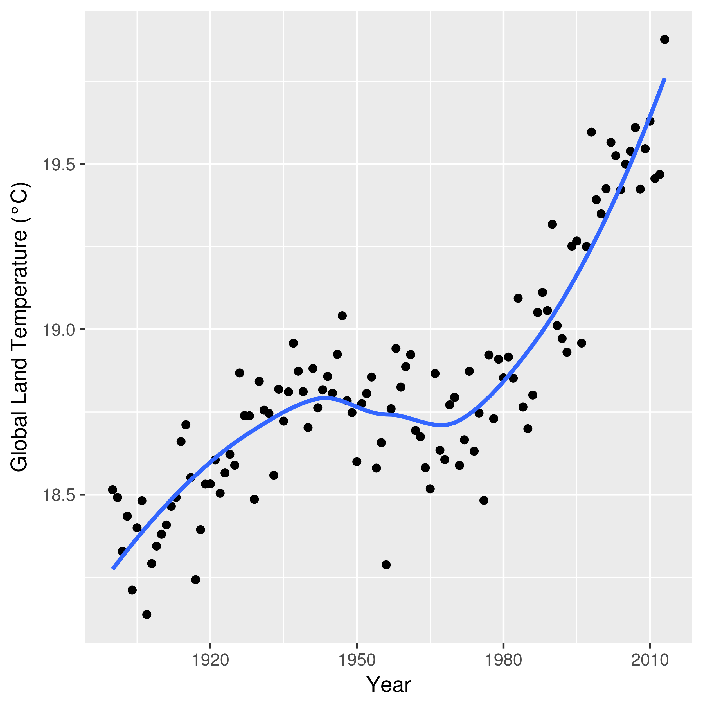
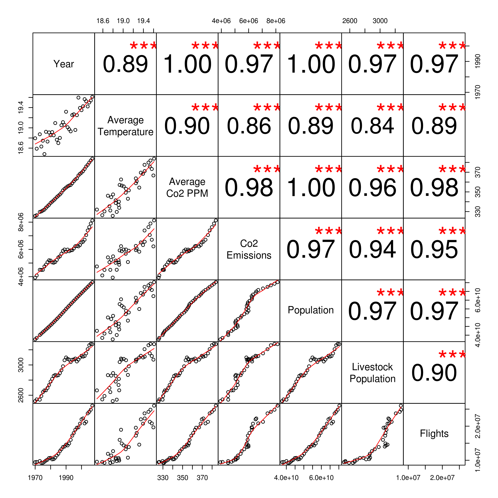
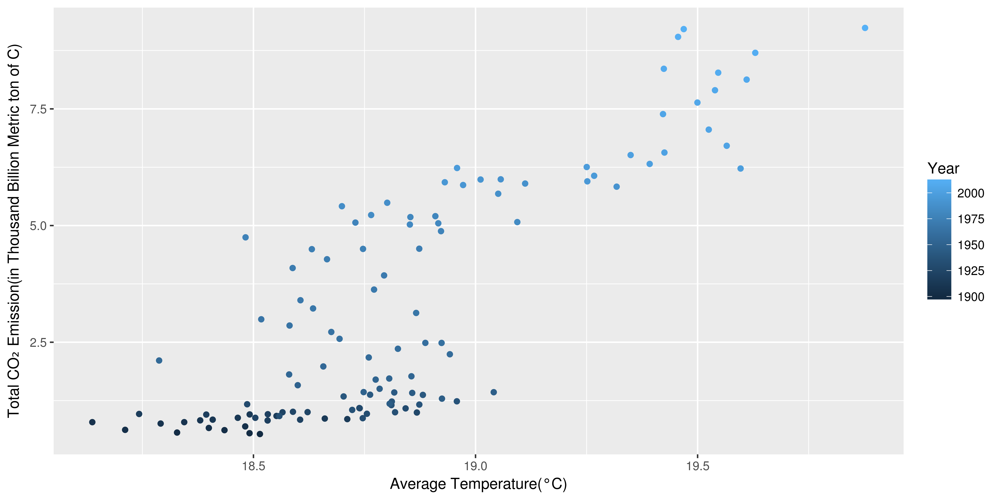
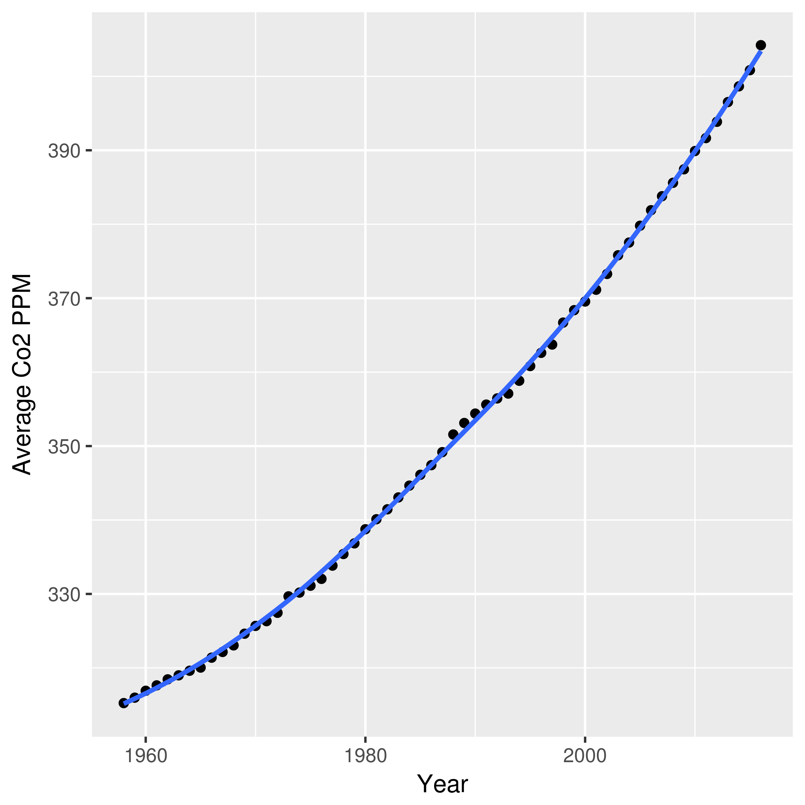
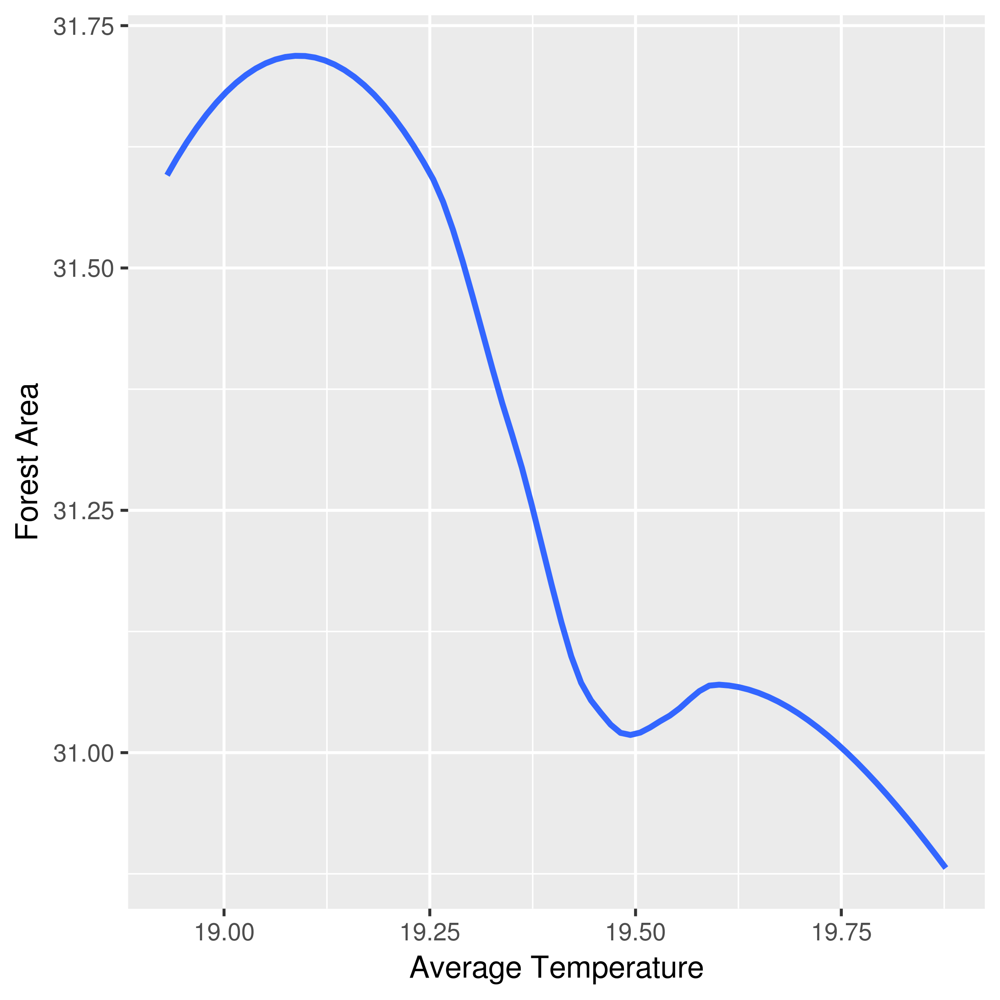
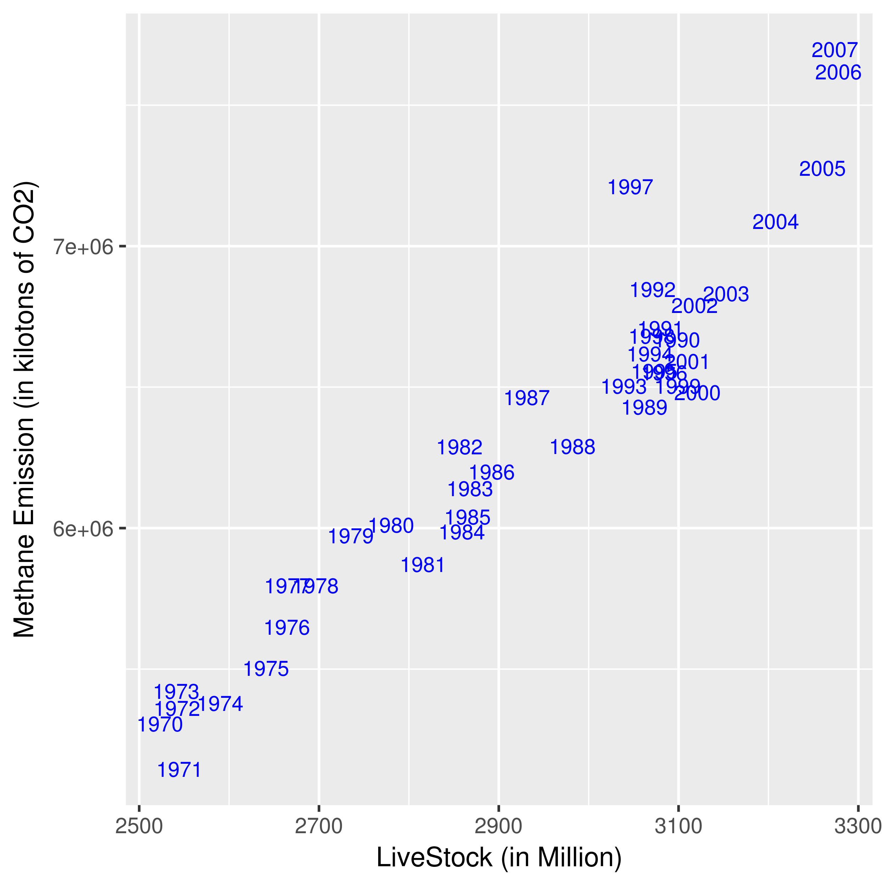
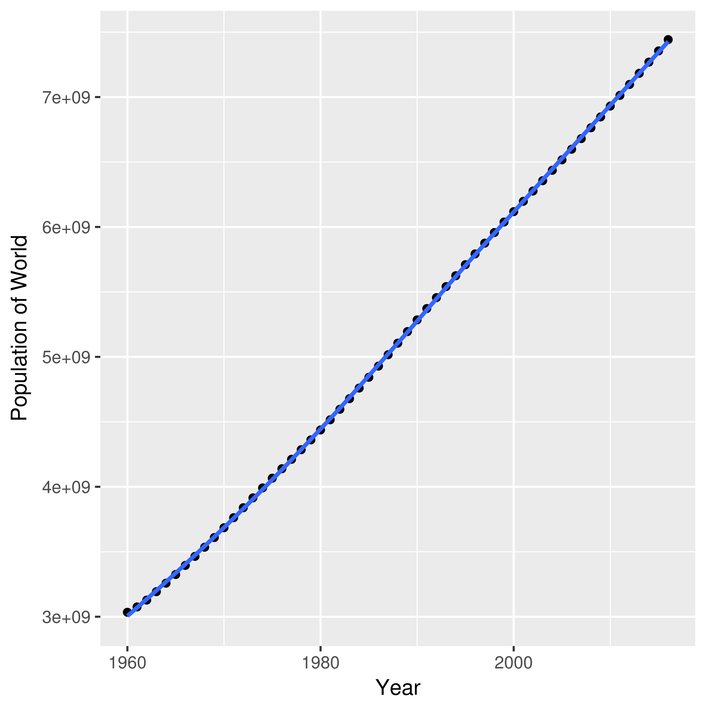

# Pollution and Climate Change

Team Mates:
* Gaurav Ganna
* Shivam Kumar
* Abhishek Varghese
  
### 1. Introduction and Overview 

"Global Warming"---a.k.a. the climate change---is the rise in the average temperature of the Earth's climate system and its related effects. The climate change (CC) had and will have serious effects such as the extinction of species, extensive melting of glacier ice in the Arctic and Antarctic, the sea level rise around the world. 

Daily reports published in newspapers, research articles, and even the High school textbooks suggest various possible factors or causes like [carbon dioxide](https://climate.nasa.gov/causes/), [chlorofluorocarbons](https://climate.nasa.gov/causes/), [population](https://www.biologicaldiversity.org/programs/population_and_sustainability/climate/), [forest area](https://www.iucn.org/resources/issues-briefs/forests-and-climate-change), [livestock population](https://www.sciencedirect.com/science/article/pii/S221209631730027X), etc., that lead to CC. In this project, we take into account some of these factors and study their effects on CC. This project aims to determine the key factors that are responsible for CC and suggest recommendations to tackle them.

### 2. [Datasets](./Data/README.md)

Identifying good data was a challenge in this project. We listed a few variables based on our intuition and then performed an in-depth search on the Internet for any available datasets. We used popular sites such as Kaggle, World Bank, data.gov.in to get reliable sources. Table Data Sources gives more details on the sources of the data collected.

Another issue with data acquisition was the unavailability of adequate data points, for features identified. For example, for some datasets, data was only available for the last 20-25 years, while for some datasets, data was available for the last century or more. There were also questions on the credibility of methods incorporated for datasets that span over a century, which we will explain later.

Note: The lack of enough data points led to the removal of feature *forest cover area* from our consolidated dataset. Although, correlation-plots based on the available data points tells that *forest area cover* is negatively correlated with other variables, extensive experiments are required to reach any conclusion. This suggested us that even if we remove forest area data, we are not losing an important (possible) factor (I think we should remove this sentence).

### 3. Exploratory Data Analysis

Exploratory Data Analysis (EDA) is an approach to analyzing data sets by summarizing their main characteristics, often with visual methods. EDA comprises to find what the data can tell us beyond the raw shape of it. Perform EDA in the early part of a machine learning project can help getting a sense of the data. We can thus select interesting features and create new features from existing ones. It also helps in choosing which algorithm to use in our analyses. We used the R programming environment to visualize datasets.

The variables used are as follows:
* CO₂ emission
* Methane emission
* Population rise
* Nitrous Oxide
* GDP 
* Aviation industry
* Number of natural disasters and many more

A big challenge in front of us was the different time range in which data was collected. Some data is from the Mid 18th century while some data is only of the last 20-25 Years. From the temperature-time lineplot shows that the temperature started rising significantly after year 1900. This suggested including data collected after year 1900.  Also we were unsure about the accuracy of the methods used in the collection of data before 1900. Moreover, data for most of the variables were available for the last century only.

Temperature–time lineplot: The basic average temperature-time analysis shows us that the world temperature kept rising over the past century.

> Global land temperature versus calendar year. 

The above plot is fascinating. This visualization is one of the most important points to push forward the fact that the global temperature is indeed rising. But one can notice a significant anomaly during the Mid 20th Century. There are different reasons given to this anomaly(Source: Internet) which were tested by us during our Project. One of them says that this is due to change in the way we measure temperature. Before World War II, the sea temperature was measured by the US war ships which measured the water which was used to cool their engines. So the water was measured in the engine rooms which had a hotter temperature than the average. After World War II, UK ships used to collect the readings. They used to collect water in buckets. The cool air blowing made the water collected a little cooler than the average. This and other reasons are deeply discussed in [Project Log 5](https://github.com/iitgoa-ml/climate-change/blob/master/Project%20Logs/PLog_D5.md)

To remove redundant variables we plotted correlation plot between variables. On the basis of this plot, we removed the forest Cover area data despite "Correlation doesn't mean causation". This also solidified the statement "LiveStock Population are cause of large portion of methane emission"

>Matrix Plot

Following is our study of various factors, their visualizations and conclusion out of it. 

* **CO₂ Emissions**

>CO2 Emissions vs Average temperature world

We can see that there is an exponential increase in CO₂ emission with increase in temperature during the period 1850-1950. After 1950 this increase is more or less linear with temperature. Hence we can see that there is a correlation between CO₂ emissions and average temperature of the world which goes hand in hand with the theoretical model of increase in temperature due to CO₂ emission.

Another good measure is to have a look at the actual amount of CO₂ present in the atmosphere. This can be done by measuring number of CO₂ molecules in 1 million molecules of air (given by CO₂ parts per million). The following graphs shows time series of Co2PPM.

>Average Co2 PPM by Year

From both of the visualizations, the amount of CO₂ in the air is highly correlated with global temperature. And it may be a possible cause for increasing temperature.

* **Deforestation**

>Deforestation vs Average Temperature

As per theoretical model, *"trees help to regulate the CO₂- O₂ balance. Hence cutting down trees will result in an increase in CO₂ levels and hence increase in global temperatures"*. It is evident from the time series of forest area that the forest cover has been decreasing constantly with time, and from the matrix plot it can be seen that Forest Area is negatively correlated with temperature.

* **Methane Emission**

There are several factors to methane emission. Emission from Livestock is one such factor (and perhaps the most important one). The following is a comparison of livestock vs methane. Both are highly correlated.

> Methane Emission vs Livestock

From the above visualization livestock seems a good substitute for methane emission to be used as a variable in the linear modeling. This is concluded from the fact that livestock and methane are nearly linearly dependent and highly correlated and both increase with time.

From the matrix plot it is seen that temperature is increasing with increase in number of livestocks. Hence our observation agrees with the theory of greenhouse effect of methane.

* **Population**

The constant increase in population is one of the biggest challenges world is facing. We know it to be source of many problems and events. The real question is "Does it also affect temperature ?"

To know this we take a look at the population time series and compare it with temperature.

>Population vs Year

### 4. Methods to find a suitable Model
The above visualisations seems to agree with the theoretical models that temperature is affected by these factors. But "Which factor affects the temperature in what amount?" This is question which is answered in this section.

The data was analysed and filtered. Linear Modeling & Random Forest were used on this filtered data. The main aim was to find the dependence of Temperature on these variables. 
   
   * _Linear Model_ : This is a supervised learning method. In this method, we fit a hypothesis function of hyperplane using observations in our training set such that mean squared error, between the real target and our prediction, is minimized. The data is usually normalized before use to remove the problem caused by differences in range among features. 
   By fitting the linear model to our data, We get an equation of hyperplane. When we substitute the value of features in the equation, we got our predictions.

        The Data was Normalized and put inside R's lm() model. The result is as follows :

<table>
         <tr align="right">
         <th>Coefficients</th>       <th>Estimate</th>    <th>Std. Error</th>      <th>P-value</th>
         </tr>
         <tr align="right">
         <td>(Intercept)</td>        <td>19.32692</td>      <td>0.02699</td>      <td> &lt;2e-16</td>
         </tr>
         <tr align="right"><td>Average CO₂ PPM</td>        <td>2.43866</td>      <td>0.71263</td>   <td>0.0057 </td> </tr> 
         <tr align="right"><td>CO₂ Emissions</td>     <td>-0.70200</td>      <td>0.28971</td>   <td>0.0338 </td>  </tr>
         <tr align="right"><td>forestArea</td>        <td>1.05290</td>      <td>0.61980</td>  <td>0.1174</td>    </tr>
         <tr align="right"><td>Population</td>       <td>-0.63731</td>      <td>0.81515</td>  <td>0.4508</td>    </tr>
         <tr align="right"><td>liveStock in Million</td> <td>-0.11452</td>      <td>0.16682</td> <td>0.5066</td>    </tr>
         <tr align="right"><td>Flights</td>           <td>0.18634</td>      <td>0.16566</td>  <td>0.2846</td>    </tr>
</table>

 
The Linear Model shows that among all, average CO₂ parts per million is the variable with the most important. The second most important variable is CO₂ Emissions.

   * _Random Forest_ : This is an ensemble learning method. In this method, A collection of decision trees are created on a random sample of features from training data. To get our prediction we take the average of predictions from all decision trees. This gives us a better prediction with low variance compared to the decision tree method.

<table>
       <tr align="right"><th>Variables</th>                   <th>IncNodePurity</th></tr>
       <tr align="right">  <td>Average CO₂PPM</td>        <td>0.2144819</td></tr>
       <tr align="right">  <td>Population</td>           <td>0.1808288</td></tr>
       <tr align="right">  <td>liveStock population</td>     <td>0.1624015</td></tr>
       <tr align="right">  <td>Flights</td>              <td>0.1842459</td></tr>
</table>      

We can see that average CO₂ parts per million has more purity than others hence affects temperature more.

### 5. Results and discussion

From our Linear Model and Random Forest Model, the biggest culprit in Global Warming turned out to be Carbon Dioxide gas. The biggest source of CO₂ Emission in the atmosphere is due to human activities. Increasing deforestation, increasing number of vehicles, increasing energy demands, etc raises serious concern on the quality of air in the future. Hence it is suggested to every Human Being to rely on energy sources that don't emit carbon dioxide for energy production. We should also minimize the use and share rides with other people when we are using motor vehicles that are operating on fossil fuels.  By doing these things we can minimize the emission of carbon dioxide and hopefully minimize the rate at which temperature is increasing. We also encourage countries to make more efforts in renewable energy production and to work on the Paris Agreement.

Every one of us should do whatever we can to rely less on carbon-emitting energy sources to have a happy and safe future for us and our coming generations.
    

### Appendix:

##### Linear Model results:-

    lm(formula = AvgTemp ~ AvgeCo2PPMCentered + Co2EmissionsCentered + 
        forestAreaCentered + PopulationCentered + liveStockMillionCentered + 
        FlightsCentered, data = AllData)

    Residuals:
        Min        1Q    Median        3Q       Max 
    -0.217215 -0.026686  0.002288  0.056065  0.142787 

    Coefficients:
                            Estimate Std. Error t value Pr(>|t|)    
    (Intercept)              19.32692    0.02699 716.059   <2e-16 ***
    AvgeCo2PPMCentered        2.43866    0.71263   3.422   0.0057 ** 
    Co2EmissionsCentered     -0.70200    0.28971  -2.423   0.0338 *  
    forestAreaCentered        1.05290    0.61980   1.699   0.1174    
    PopulationCentered       -0.63731    0.81515  -0.782   0.4508    
    liveStockMillionCentered -0.11452    0.16682  -0.687   0.5066    
    FlightsCentered           0.18634    0.16566   1.125   0.2846    
    ---
    Signif. codes:  0 ‘***’ 0.001 ‘**’ 0.01 ‘*’ 0.05 ‘.’ 0.1 ‘ ’ 1

#### Random forest model results:-

		Call:
		 randomForest(formula = AvgTemp ~ AvgeCo2PPM + Co2Emissions +      Population + liveStockMillion + Flights, data = AllData) 
		               Type of random forest: regression
		                     Number of trees: 500
		No. of variables tried at each split: 1

		          Mean of squared residuals: 0.02812826
		                    % Var explained: 42.54
		                 IncNodePurity
		AvgeCo2PPM           0.1510609
		Co2Emissions         0.1402186
		Population           0.1523441
		liveStockMillion     0.1349813
		Flights              0.1630979

### References 

 We used the following publicly available datasets.Datahub, World Bank, Kaggle, data.gov.in and other websites. We are thankful to these sites for making these data publically available.

* [CO2 Emissions from Fossil Fuels since 1751, By Nation](https://datahub.io/core/co2-fossil-by-nation)
* [CO2 PPM - Trends in Atmospheric Carbon Dioxide](https://datahub.io/core/co2-ppm)
* [CO2 emissions (kt)](https://data.worldbank.org/indicator/EN.ATM.CO2E.KT)
* [Forest area](https://data.worldbank.org/indicator/AG.LND.FRST.ZS)
* [GDP(PPP) Country-Wise](https://data.worldbank.org/indicator/NY.GDP.MKTP.PP.CD)
* [GDP(PPP) Country-Wise](https://data.worldbank.org/indicator/NY.GDP.MKTP.CD)
* [Methane emissions (kt of CO2 equivalent)](https://data.worldbank.org/indicator/EN.ATM.METH.KT.CE)
* [Methane emissions in energy sector](https://data.worldbank.org/indicator/EN.ATM.METH.EG.KT.CE)
* [Nitrous oxide emissions](https://data.worldbank.org/indicator/EN.ATM.NOXE.KT.CE)
* [Air transport, passengers carried](https://data.worldbank.org/indicator/IS.AIR.PSGR)
* [World Livestock Population](https://data.worldbank.org/indicator/AG.PRD.LVSK.XD)
* [Earth Surface Temperature Data](https://www.kaggle.com/berkeleyearth/climate-change-earth-surface-temperature-data)
* [All India Area Weighted Monthly, Seasonal And Annual Rainfall (in mm)](https://data.gov.in/resources/all-india-area-weighted-monthly-seasonal-and-annual-rainfall-mm)

-----------------------

### [Meeting Minutes](./mm.md)

### [Project Logs](https://github.com/iitgoa-ml/climate-change/tree/master/Project%20Logs)

### Some useful links 

* More about writing styles -- [The Chicago Manual of Style](http://www.chicagomanualofstyle.org/home.html)
* Google R writing style guide -- [R Style Guide](https://google.github.io/styleguide/Rguide.xml)
* Linear Regression -- [Linear Regression](https://feliperego.github.io/blog/2015/10/23/Interpreting-Model-Output-In-R)
    
### [Future Work](./Future_Work)
